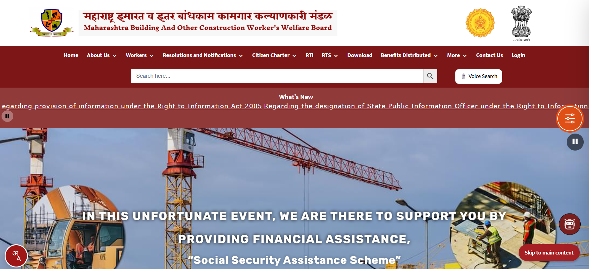
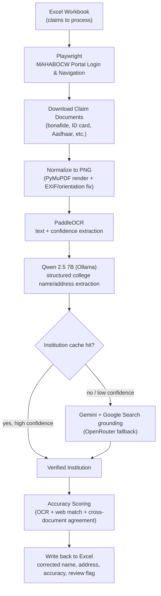

# MAHABOCW Workers Scheme Verification Automation

**Project type:** Intelligent Document Processing (IDP) + browser automation
**Language:** Python
**Target users:** Maharashtra Building & Other Construction Workers Welfare Board (MAHABOCW) verification team
**Status:** Active development



## 1. Purpose

MAHABOCW medical scholarship applicants often enter incomplete, misspelled, or inconsistent college names and addresses in the portal. Verifying each claim by hand — opening documents, reading certificates, and correcting the tracking workbook — is slow and error-prone.

This project automates that verification. It logs into the MAHABOCW portal, pulls each claim's supporting documents, reads them with OCR, extracts structured college details with a local LLM, confirms the institution against the web with Gemini, and writes the corrected, confidence-scored results back to Excel.

For the full technical breakdown, see [`ARCHITECTURE.md`](./ARCHITECTURE.md).

## 2. How It Works



The pipeline runs in two document phases per claim: **Phase 1** (bonafide certificate, college ID) first, and **Phase 2** (Aadhaar, ration card, self-declarations) only if Phase 1 doesn't yield a satisfactory result. Every accepted institution match is cached locally so repeat lookups skip the OCR/LLM/search round-trip.

## 3. Repository Layout

| Path | Purpose |
| --- | --- |
| `verify_colleges.py` | Main orchestration script — Excel I/O, browser automation, phase control, scoring, output writes. |
| `document_processor.py` | Converts PDFs/images to normalized PNG pages; hashing and orientation correction. |
| `ocr_engine.py` | PaddleOCR initialization and `ocr_image()`. |
| `extractor.py` | Ollama/Qwen-based document classification and college detail extraction. |
| `web_resolver.py` | Institution resolution via cache, Gemini search grounding, and OpenRouter fallback. |
| `requirements-lock.txt` | Frozen dependency snapshot. |
| `MahaBOCW.png` | Portal reference screenshot. |

Untracked runtime files (created locally, not in git): `requirements.txt`, `logger_config.py`, `.env`, `institution_cache.json`, `downloads/`, `logs/`, `testing/`.

## 4. Setup

```powershell
python -m venv venv
.\venv\Scripts\Activate.ps1
pip install -r requirements.txt
playwright install chromium
```

Install the GPU build of PaddlePaddle separately, since it depends on the CUDA wheel:

```powershell
pip install paddlepaddle-gpu==2.6.2 -i https://www.paddlepaddle.org.cn/packages/stable/cu118/
```

The project uses `nvidia-cudnn-cu11` so cuDNN DLLs resolve from the Python environment without a system-wide CUDA install.

Pull the extraction model in Ollama:

```powershell
ollama pull qwen2.5:7b-instruct
```

Create a `.env` file in the project root with the resolver keys:

```text
GEMINI_API_KEY=...
OPENROUTER_API_KEY=...
```

`OPENROUTER_API_KEY` is only used as a fallback when every Gemini model call fails.

### Running the pipeline

```powershell
python verify_colleges.py
```

The browser opens in non-headless mode. Log in to the MAHABOCW portal manually, open the Claims section, bring the Acknowledgement Number filter into view, then return to the terminal and press Enter. The script processes the configured row window, saves documents under `downloads/`, logs to `logs/`, and updates the output Excel workbook — resuming safely if interrupted, since already-processed rows are skipped.

---

See [`ARCHITECTURE.md`](./ARCHITECTURE.md) for full stage-by-stage technical detail, and [`AGENTS.md`](./AGENTS.md) if you're an AI coding assistant working in this repo.
