# Architecture

This document is the authoritative, detailed description of how the MAHABOCW verification pipeline works end to end. It should stay in sync with the code at all times — see the update rule at the bottom of this file and in `AGENTS.md`.

## 1. System Overview

The pipeline turns a workbook of scholarship claims into a verified, scored, corrected workbook. It combines:

- **Browser automation** (Playwright) to pull claim documents out of a government portal that has no API.
- **Computer vision / OCR** (PaddleOCR) to turn scanned certificates into text.
- **A local LLM** (Qwen 2.5 7B via Ollama) to turn noisy OCR text into structured fields.
- **A cloud LLM with web grounding** (Gemini + Google Search, OpenRouter fallback) to resolve the extracted institution to one canonical, verified record.
- **Deterministic scoring** to decide which rows still need a human to look at them.

```mermaid
flowchart TD
    subgraph Input
        A["Excel Workbook<br/>(rows 2-30 by default)"]
    end

    subgraph "Stage 1 · Portal Navigation"
        B1["Playwright launches Chromium<br/>(non-headless)"]
        B2["Manual login + captcha + AG Grid setup"]
        B3["Filter grid by acknowledgement_no"]
        B4["Open claim form, parse with BeautifulSoup"]
        B5["Collect document URLs:<br/>bonafide, college ID, Aadhaar,<br/>ration card, self declarations"]
        B1 --> B2 --> B3 --> B4 --> B5
    end

    subgraph "Stage 2 · Phased Document Processing"
        C1["Phase 1: bonafide + college_id"]
        C2{"Satisfactory result?"}
        C3["Phase 2: aadhaar, ration,<br/>self declarations (fallback)"]
        C1 --> C2
        C2 -- no --> C3
    end

    subgraph "Stage 3 · Normalization"
        D1["Download with retry + SHA-256 dedupe"]
        D2["PDF to PNG @300 DPI (PyMuPDF)"]
        D3["EXIF orientation fix"]
        D4["PaddleOCR 4-angle rotation sweep"]
        D1 --> D2 --> D3 --> D4
    end

    subgraph "Stage 4 · OCR"
        E1["PaddleOCR (GPU) per page"]
        E2["avg_confidence, min_confidence,<br/>high_conf_ratio, line_count"]
        E1 --> E2
    end

    subgraph "Stage 5 · Local LLM Extraction"
        F1["Qwen 2.5 7B via Ollama"]
        F2["Classify page relevance"]
        F3["Extract JSON: student_name, academic_year,<br/>college_name, college_address"]
        F1 --> F2 --> F3
    end

    subgraph "Stage 6 · Institution Resolution"
        G1["Clean OCR address (regex)"]
        G2{"RapidFuzz cache match >= 90?"}
        G3["Gemini + google_search grounding<br/>model fallback chain"]
        G4["OpenRouter fallback if all Gemini fail"]
        G5{"Match confidence >= 75?"}
        G6["Accept + write to institution_cache.json"]
        G7["Fallback: cleaned OCR address,<br/>resolution_failed=True"]
        G1 --> G2
        G2 -- yes --> G6
        G2 -- no --> G3
        G3 -- fails --> G4
        G4 --> G5
        G3 -- succeeds --> G5
        G5 -- yes --> G6
        G5 -- no --> G7
    end

    subgraph "Stage 7 · Scoring & Output"
        H1["OCR confidence: 0-30 pts"]
        H2["Web verification: 0-40 pts"]
        H3["Cross-document agreement: 0-30 pts"]
        H4["accuracy = sum, 0-100"]
        H5{"accuracy < 80?"}
        H6["manual_review = YES"]
        H7["Write columns to Excel,<br/>save after every claim"]
        H1 --> H4
        H2 --> H4
        H3 --> H4
        H4 --> H5
        H5 -- yes --> H6 --> H7
        H5 -- no --> H7
    end

    A --> B1
    B5 --> C1
    C1 --> D1
    C3 --> D1
    D4 --> E1
    E2 --> F1
    F3 --> G1
    G6 --> H2
    G7 --> H2
```



## 2. Stage-by-Stage Detail

### Stage 1 — Claim Navigation and Document Discovery
**File:** `verify_colleges.py`

- Launches Chromium through Playwright in **non-headless** mode so a human can complete login and captcha.
- Opens `https://iwbms.mahabocw.in/sso` and pauses for manual login and AG Grid setup (the user must open the Claims section and leave the Acknowledgement Number filter box visible/open before the script continues).
- For each selected row in the input workbook, filters the portal's AG Grid by `acknowledgement_no`, opens "View claim form" in a new tab, and parses the HTML with BeautifulSoup.
- Collects document URLs for: Bonafide Certificate, College Identity Card, Aadhaar Card, Ration Card, Self Declaration, Education Self Declaration.
- The row window processed is controlled in code:
  ```python
  rows_to_process = pd.concat([df.iloc[0:30]])  # Excel rows 2-30
  ```

### Stage 2 — Priority/Fallback Document Processing
**Files:** `verify_colleges.py`, `document_processor.py`

Documents are processed in two phases to reduce OCR/LLM/API cost and runtime:

| Phase | Documents | Purpose |
| --- | --- | --- |
| Phase 1 | `bonafide`, `college_id` | Fast path — the most reliable evidence of institution identity. |
| Phase 2 | `aadhaar`, `ration`, `self_declaration`, `education_self_declaration` | Fallback, run only when Phase 1 does not produce a satisfactory college name + address. |

For each document: downloads retry up to 3 times with 2s/4s backoff; a SHA-256 hash is computed to skip duplicate uploads within the same claim; PDFs render to 300 DPI PNG pages via PyMuPDF; images convert to PNG; unsupported formats are skipped.

### Stage 3 — Orientation Normalization
**File:** `document_processor.py`

Two-stage orientation correction:
1. **EXIF correction** — `PIL.ImageOps.exif_transpose()` fixes mobile-photo orientation metadata.
2. **PaddleOCR rotation sweep** — each page is tested at 0°, 90°, 180°, 270°; the angle with the best average OCR confidence wins, with line count as a tiebreaker.

This replaced an earlier, brittle Tesseract-style orientation heuristic, keeping orientation decisions aligned with the actual OCR engine's own confidence signal.

### Stage 4 — OCR and OCR Quality Metrics
**File:** `ocr_engine.py`

- PaddleOCR is initialized **once**, globally, so the model isn't reloaded per page.
- Uses GPU/CUDA when PaddlePaddle reports CUDA support; adds NVIDIA package `bin` directories to `PATH`/DLL search paths when available.
- Sets `PROTOCOL_BUFFERS_PYTHON_IMPLEMENTATION=python` before protobuf imports to avoid a PaddlePaddle/`google-genai` binary protobuf conflict.
- Uses `use_angle_cls=True` for PaddleOCR's built-in 0/180° text-line classifier.
- Suppresses Paddle's C++ log noise and the recurring "first GPU is used for inference by default" warning.

`ocr_image(image_path)` returns:
```json
{
  "text": "joined OCR text",
  "avg_confidence": 0.0,
  "min_confidence": 0.0,
  "high_conf_ratio": 0.0,
  "line_count": 0
}
```
These metrics feed both extraction quality checks and the final accuracy score.

### Stage 5 — Local LLM Extraction
**File:** `extractor.py`

OCR text is sent to a locally running Ollama model:
```python
MODEL = "qwen2.5:7b-instruct"
```
The prompt first classifies the page as one of: Bonafide Certificate, Student Identity Card, or irrelevant (Aadhaar/Ration Card/Self Declaration). For relevant pages, it must return strict JSON:
```json
{
  "relevant": true,
  "document_type": "bonafide",
  "student_name": "...",
  "academic_year": "...",
  "college_name": "...",
  "college_address": "..."
}
```
The prompt includes OCR-correction rules for missing spaces, wrong capitalization, common medical-college spelling corruptions, character substitutions (`0`/`O`, `1`/`I`/`l`), and separating a managing trust/foundation name from the actual degree-granting institution.

`is_satisfactory()` only returns `True` when a relevant result contains **both** `college_name` and `college_address` — this is what gates whether Stage 2 falls through to Phase 2 documents.

### Stage 6 — Online Institution Resolution
**File:** `web_resolver.py`

The resolver's current design is a **Gemini native-search flow** (it replaced an earlier SerpApi-plus-ranking flow; SerpApi helper code still exists as an unused extension point, not wired into `resolve_institution()`).

Flow, in order:

1. `clean_address()` strips noise (phone/fax/email/website mentions, extra whitespace, duplicate commas, generic-title suffixes like "- Wikipedia") from the OCR-extracted address using deterministic regex rules.
2. `_find_cache_record()` checks `institution_cache.json` using RapidFuzz token-set matching against the extracted name.
3. **Cache hit** (score ≥ `CACHE_HIT_THRESHOLD = 90`): the cached `official_name`/`official_address`/`city` are returned immediately with `match_confidence = 100`, `resolution_failed = False`, `via_cache = True`. No API calls are made.
4. **Cache miss**: `GeminiResolver.resolve()` is called with the OCR name/address. It tries Gemini models in this fallback order, using native `google_search` grounding tools:
   - `gemini-2.5-pro`
   - `gemini-2.0-flash`
   - `gemini-2.5-flash`
   - `gemini-2.5-flash-lite`
5. If every Gemini model call raises, the resolver falls back to an **OpenRouter** chat completion instead.
6. The response is parsed as strict JSON (`verified_college_name`, `verified_college_address`, `city`).
7. `_is_generic_name()` rejects vague/incomplete institution names (e.g. just "Medical College" with no proper noun) and forces a fallback result.
8. `_compute_confidence()` computes a RapidFuzz token-set score between the resolved official name and the original OCR-extracted name. If confidence `< CONFIDENCE_REJECT_THRESHOLD = 75`, the resolver falls back to the cleaned OCR values with `resolution_failed = True`.
9. If official address or city is missing even after a confident name match, the resolver also falls back.
10. On success, the record is written into `institution_cache.json` under a normalized key, with the OCR-extracted name added to that record's `aliases` list so future fuzzy variants of the same name hit the cache directly.

The resolver **prefers the model/search-provided official address** when available; it only falls back to the cleaned OCR address when resolution fails outright.

### Stage 7 — Accuracy Scoring and Excel Output
**File:** `verify_colleges.py` (`compute_accuracy()`)

Each claim gets a 0–100 accuracy score from three independent, auditable signals:

| Component | Max points | Logic |
| --- | ---: | --- |
| OCR confidence | 30 | `min(round(avg_confidence * 30), 30)` across all processed pages. |
| Web verification | 40 | `round((match_confidence / 100) * 40)` when resolution succeeds; cache hits get `match_confidence = 100` → full 40 pts; failed resolution → 0 pts. |
| Cross-document agreement | 30 | 30 pts if ≥2 documents were LLM-flagged `relevant` (bonafide/student ID only); 15 pts for exactly 1; 0 otherwise. Aadhaar/Ration/Self-Declaration pages never count here even if readable. |

Rows are flagged `manual_review = "YES"` when `accuracy < ACCURACY_THRESHOLD` (80 by default), or no usable extraction exists, or the best extraction result wasn't marked relevant.

Output workbook: `Test_Data_Medical_Claim_Data_Output.xlsx`, sheet `Test Data`. The script creates/updates columns `corrected_college_name`, `corrected_college_address`, `accuracy`, `manual_review`, `online_verification_status`. Progress saves after **every** processed claim, with retry-on-save if the output file is currently open in Excel. If the output file already exists, it is reused — previously completed rows (where `corrected_college_name` is already populated) are skipped, making re-runs resumable.

## 3. Tools and External Services

**Local:** Python, Playwright (Chromium), PaddleOCR, PaddlePaddle GPU, Ollama, Qwen `qwen2.5:7b-instruct`, PyMuPDF, OpenCV, Pillow, Pandas, BeautifulSoup, RapidFuzz, tqdm.

**Cloud/API:** Google Gen AI SDK (`google-genai`), Gemini models with native Google Search grounding, OpenRouter chat completions (fallback only).

**Environment variables** (`.env`, not committed):
```text
GEMINI_API_KEY=...
OPENROUTER_API_KEY=...
```
`OPENROUTER_API_KEY` is only required when every Gemini model call fails.

## 4. Runtime Artifacts (not tracked in git)

- `requirements.txt` — human-maintained install guide (`requirements-lock.txt` is the frozen snapshot (not tracked either)).
- `logger_config.py` — central logging setup; clean console output plus timestamped DEBUG log files under `logs/`.
- `downloads/` — per-claim downloaded documents and normalized page images.
- `logs/` — timestamped debug logs.
- `testing/` — sample spreadsheets and reference PDFs.

## 5. Known Constraints

- The pipeline is **semi-automated by design** — portal login and captcha handling stay manual because the portal has no API and captchas can't be reliably automated.
- Portal automation is coupled to the current MAHABOCW UI structure and AG Grid behavior; a portal UI change can break Stage 1.
- The processed row window (`df.iloc[0:30]`) is hardcoded in `verify_colleges.py` and must be edited manually to process a different batch.
- The old SerpApi-based resolver path is present in code as comments/helpers but is dead code — do not assume it runs.

---

## Keeping this document current

**This file must be updated immediately after any change to pipeline stages, file responsibilities, scoring logic, model/provider fallback chains, thresholds, or data flow.** See `AGENTS.md` for the enforced workflow. A pull request that changes architecture without a corresponding `ARCHITECTURE.md` update should be treated as incomplete.
