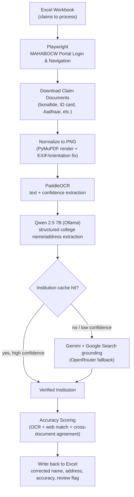

# MAHABOCW Workers Scheme Verification Automation

**Project type:** Intelligent Document Processing (IDP) + browser automation
**Language:** Python
**Target users:** Maharashtra Building & Other Construction Workers Welfare Board (MAHABOCW) verification team
**Status:** Active development

[](https://iwbms.mahabocw.in/sso)

## 1. Purpose

MAHABOCW medical scholarship applicants often enter incomplete, misspelled, or inconsistent college names and addresses in the portal. Verifying each claim by hand — opening documents, reading certificates, and correcting the tracking workbook — is slow and error-prone.

This project automates that verification. It logs into the MAHABOCW portal, pulls each claim's supporting documents, reads them with OCR, extracts structured college details with a local LLM, confirms the institution against the web with Gemini, and writes the corrected, confidence-scored results back to Excel.

For the full technical breakdown, see [`ARCHITECTURE.md`](./ARCHITECTURE.md).

## 2. How It Works



The pipeline runs in two document phases per claim: **Phase 1** (bonafide certificate, college ID) first, and **Phase 2** (Aadhaar, ration card, self-declarations) only if Phase 1 doesn't yield a satisfactory result. Every accepted institution match is cached locally so repeat lookups skip the OCR/LLM/search round-trip.

## 3. Repository Layout

| Path                    | Purpose                                                                                           |
| ----------------------- | ------------------------------------------------------------------------------------------------- |
| `verify_colleges.py`    | Main orchestration script — Excel I/O, browser automation, phase control, scoring, output writes. |
| `document_processor.py` | Converts PDFs/images to normalized PNG pages; hashing and orientation correction.                 |
| `ocr_engine.py`         | PaddleOCR initialization and `ocr_image()`.                                                       |
| `extractor.py`          | Ollama/Qwen-based document classification and college detail extraction.                          |
| `web_resolver.py`       | Institution resolution via cache, Gemini search grounding, and OpenRouter fallback.               |

## 4. Setup & Usage

> **🚀 Quick Start** If you simply want to test or use the final software, head over to the **Releases v2.0.0** section to the right and download the two packaged `.exe` installers at the bottom.

### Developer Setup (Pipeline)

1. **Environment:**
   ```powershell
   python -m venv venv
   .\venv\Scripts\Activate.ps1
   pip install -r requirements.txt
   pip install paddlepaddle-gpu==2.6.2 -i https://www.paddlepaddle.org.cn/packages/stable/cu118/
   playwright install chromium
   ```
2. **Local AI Model:** `ollama pull qwen2.5:7b-instruct`
3. **Environment Variables:** Create a `.env` file with `GEMINI_API_KEY=...` (and optionally `OPENROUTER_API_KEY=...` for fallback).
4. **Run:** Execute `python verify_colleges.py`. When the browser opens, manually log into the MAHABOCW portal, navigate to the Claims section, then return to the terminal and press Enter to begin automation.

### Developer Setup (GUI)

A user-friendly desktop application (React/Tailwind + pywebview) is available to configure and run the pipeline visually. All GUI code is in the [`gui/`](../gui/) directory.

To build the standalone GUI executable:

```powershell
cd gui\frontend && npm run build
cd .. && pyinstaller packaging\mahabocw_gui.spec
```

For full instructions, see the [GUI Developer Guide](../gui/README.md).

---

See [`ARCHITECTURE.md`](./ARCHITECTURE.md) for full details on the GUI's isolated subprocess architecture, and [`AGENTS.md`](./AGENTS.md) if you're an AI coding assistant working in this repo.
